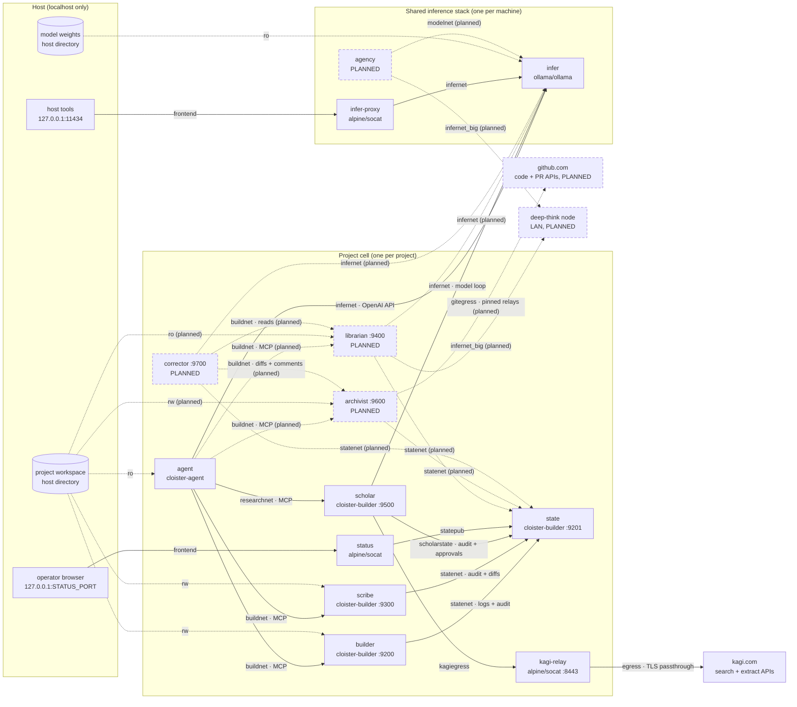

# Cloister — Runtime Architecture

What actually deploys: every container, the networks that connect them, the
worker role and image in each, the filesystem mounts, and the two localhost
ports that are the system's entire host-visible surface.  This is the *what*;
[DESIGN.md](DESIGN.md) is the *why*.

Two compose stacks make up a running system:

- **Shared inference stack** (`docker/inference.yaml`) — the GPU model
  server and its localhost bridge.  Deploy once per machine, leave up.
- **Project cell** (`docker/ai-workers.yaml`) — the agent and its workers.
  Deploy one per project; each joins the shared `infernet` by name.

## Topology

Solid arrows are network edges (labeled with the compose network that
carries them); dotted arrows are filesystem mounts or planned components.
The agent's workspace mount is read-only **today**; the
[librarian design](librarian.md) removes it entirely once reads are
mediated.

## The cell, container by container

| Container | Worker role | Image | Listens | Mounts | Networks |
|---|---|---|---|---|---|
| `agent` | the coding agent: interactive qwen-code CLI (this IS the qwen image) | `cloister-agent:<qwen>-<ver>` | — (nothing inbound) | workspace **ro**; `qwen_home` vol rw | infernet, buildnet, researchnet |
| `builder` | `-worker-mode builder` — executes manifest actions (build/test), streams logs | `cloister-builder:<ver>` | `:9200` MCP | workspace **rw**; `gradle` vol rw | buildnet, statenet |
| `scribe` | `-worker-mode scribe` — the sole audited writer of workspace source | `cloister-builder:<ver>` | `:9300` MCP | workspace **rw**; `scribe_state` vol rw | buildnet, statenet |
| `scholar` | `-worker-mode scholar` — quarantined web research, one `research` tool | `cloister-builder:<ver>` | `:9500` MCP | policy yaml **ro**; `scholar_burn` vol rw | researchnet, infernet, scholarstate, kagiegress |
| `state` | `-worker-mode state-service` — sole owner of durable logs/audit/status | `cloister-builder:<ver>` | `:9201` token-gated API + pages | `state` vol rw | statenet, scholarstate, statepub |
| `status` | blind relay publishing the status pages to the host | `alpine/socat` | `127.0.0.1:STATUS_PORT` | — | statepub, frontend |
| `kagi-relay` | blind egress pipe hard-wired to `kagi.com:443` | `alpine/socat` | `:8443` (cell-internal) | — | kagiegress, egress |

All four Go workers are the same binary (`agent-builder`) selected by the
required `-worker-mode` flag; `cloister-builder` also carries the JDK 25 +
Gradle toolchain the builder mode drives.

## The shared inference stack

| Container | Role | Image | Listens | Mounts | Networks |
|---|---|---|---|---|---|
| `infer` | GPU model server (OpenAI-compatible API) | `ollama/ollama` | `:11434` (infernet only) | model weights **ro** (host dir) | infernet |
| `infer-proxy` | blind relay for host staging/debugging | `alpine/socat` | `127.0.0.1:11434` | — | infernet, frontend |

## Networks

| Network | Carries | Members |
|---|---|---|
| `infernet` | model API traffic (internal: no internet; shared across stacks by name) | infer, infer-proxy, agent, scholar |
| `buildnet` | agent → builder/scribe MCP | agent, builder, scribe |
| `researchnet` | agent → scholar MCP | agent, scholar |
| `statenet` | builder/scribe → state (token-gated) | builder, scribe, state |
| `scholarstate` | scholar → state, kept off `statenet` so the scholar never shares a wire with builder/scribe | scholar, state |
| `statepub` | state → status relay | state, status |
| `kagiegress` | scholar → kagi-relay (internal; no internet) | scholar, kagi-relay |
| `egress` | the internet.  ONLY the kagi-relay holds it | kagi-relay |
| `frontend` | host publishing | status, infer-proxy |

Every network except `egress` and `frontend` is `internal: true` — no
route out.  Notable absences are the architecture: the agent has no route
to `state` (it cannot touch the record of its own actions), `infer` never
shares a network with builder or scribe, and the scholar has no route to
builder, scribe, or the workspace.

## Host surface

Exactly two localhost-only ports; nothing binds a routable interface:

- `127.0.0.1:${STATUS_PORT}` — the cell's status pages and approvals UI,
  via the blind `status` relay.  The only externally visible piece of a
  cell.
- `127.0.0.1:11434` — the inference stack's ollama API, for host-side
  model staging and debugging, via the blind `infer-proxy`.

## External dependencies

| Dependency | Used for | Path out |
|---|---|---|
| `kagi.com` | web **search** and the **extract/summarize** API (fetches and cleans pages to markdown server-side) | scholar → kagi-relay → `kagi.com:443`, TLS end-to-end (the relay pipes ciphertext) |
| `api.search.brave.com` (optional) | alternate search engine when the scholar policy selects it; extract stays Kagi-only | would need its own `brave-relay`; never yet exercised against the real API |
| deep-think node (PLANNED) | heavier librarian comprehension ops | `infernet_big`, an external network to a LAN host; address via env only |

Image pulls from GHCR happen at deploy time only; nothing in a running
cell fetches images or code.

## Named volumes

| Volume | Mounted by | Holds |
|---|---|---|
| `qwen_home` | agent | qwen-code settings/history (`/home/node/.qwen`); survives image swaps |
| `gradle` | builder | dependency + build caches (`/gradle-home`), warmed via the airlock |
| `state` | state | the durable record: logs, audit, status, approvals |
| `scribe_state` | scribe | staged approval-gated changes; survives restarts so a pending approval is never lost |
| `scholar_burn` | scholar | restart-surviving spend ledger (bare timestamps), so a crash loop cannot reset daily caps |

## Planned components

Dashed in the diagram; designed, not yet built (see
[librarian.md](librarian.md)):

- **librarian** (`:9400`) — the read side of the cell: mechanical +
  inference-backed read tools over an in-memory, `.aiignore`/`.gitignore`-
  filtered workspace model.  Holds workspace **ro**, `buildnet` (inbound
  MCP), `infernet`, `statenet`.  When it lands, the agent's workspace
  mount is removed entirely.
- **deep-think node** (`infernet_big`, see [deepthink.md](deepthink.md)) —
  an off-host inference engine for heavy comprehension ops: a natively
  jailed macOS ollama (seatbelt + PF, no outbound, blind LAN relay)
  behind the agency's presence-aware fallback chains; requests degrade to
  local `infer` when the machine is away.
- **archivist** (`:9600`, see [archivist.md](archivist.md)) — the cell's
  sole version-control authority: sole toucher of `.git` (confinement
  blocks it for everyone else), VCS-agnostic local verbs plus
  audited-ungated GitHub PR authorship as a bot identity, reaching
  `github.com`/`api.github.com` only through pinned blind relays.  The
  GitHub-side permission recipe is [GITHUB_SETUP.md](GITHUB_SETUP.md).
- **corrector** (`:9700`, see [corrector.md](corrector.md)) — the
  reviewer: no mounts, no credential; composes librarian reads, archivist
  diffs/comments, and engine-routed inference into a ten-lens, grounded,
  advice-never-gate review of any PR or the agent's pending work.
- **agency** (see [agency.md](agency.md)) — the sole inference door, in
  the shared infra stack: OpenAI-compatible front for local + LAN ollama
  nodes (frontier designed-for, unwired), engine-class fallback chains,
  residency-aware two-class queueing, caller deadlines, and a read-only
  status volume the cells' state services render.  When it lands,
  `infer` retreats behind it (existing `infernet · OpenAI API` edges
  reroute through the agency) and the localhost `11434` relay fronts the
  agency instead of raw ollama.

## The common hardening profile

Every container in both stacks runs the same jail unless noted: read-only
root filesystem with tmpfs scratch, `cap_drop: [ALL]`,
`no-new-privileges`, pids and memory limits, non-root (uid 1000; the socat
relays run as `nobody`), `restart: unless-stopped`.  Per-container
particulars: the builder gets a 2 GiB `/tmp` and a private log spool; the
agent gets 512 pids for the CLI's node runtime; `infer` gets the GPU
device reservation.

## Invariants and what enforces them

| Invariant | Enforced by |
|---|---|
| The scholar holds no `egress` network; its only route out is the kagi-relay, pinned to `kagi.com` | `compose-lint` (CI, every PR) · the scholar's fail-closed boot self-check · `scripts/probe-scholar-egress.ps1` against a live cell |
| The agent cannot write source; every edit routes through the scribe's confined, audited ops | the `:ro` mount flag · the scribe's path confinement, gates, and approval holds |
| The audit trail is one-way glass: subsystems append, never read; timestamps come from the state service's clock | token-gated append-only state API · no state mounts anywhere else · network absences above |
| Web content and workspace content never share a mediator | topology: the scholar has no workspace mount and no route to builder/scribe |
| Builds run offline; dependency refresh is a deliberate human act | no builder egress · the dependency airlock refuses to open over uncommitted build logic |
| No secrets, keys, or LAN addresses in the repo | presubmit hook + the same scan server-side in CI |
