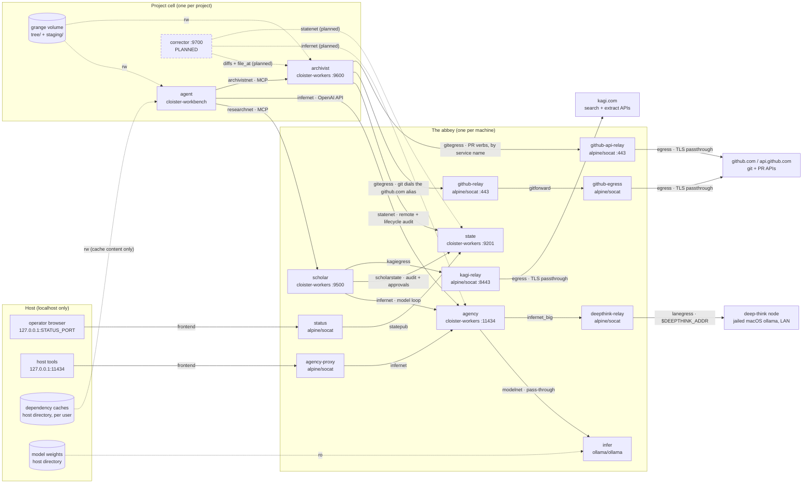

# Cloister — Runtime Architecture

What actually deploys: every container, the networks that connect them, the
worker role and image in each, the filesystem mounts, and the two localhost
ports that are the system's entire host-visible surface.  This is the *what*;
[DESIGN.md](DESIGN.md) is the *why*.

Two compose stacks make up a running system:

- **The abbey** (`docker/abbey.yaml`, [abbey.md](abbey.md)) — the
  machine's four shared doors and its memory: the **agency** (inference)
  over the GPU node, the **scholar** (research) over its pinned relay,
  the **github relays** (forge), and the **state** service (one audit
  trail, one approvals page) behind its status window.  Deploy once per
  machine, before any cell — it publishes the networks cells join.
- **Project cell** (`docker/cell.yaml`) — two services: the **agent**
  (workbench + grange) and its **archivist**.  Deploy one per project;
  each attaches to the abbey's doors by name and holds nothing shared.

## Topology

```mermaid
flowchart LR
  subgraph host["Host (localhost only)"]
    op["operator browser<br/>127.0.0.1:STATUS_PORT"]
    dbg["host tools<br/>127.0.0.1:11434"]
    caches[("dependency caches<br/>host directory, per user")]
    models[("model weights<br/>host directory")]
  end

  subgraph cell["Project cell (one per project)"]
    agent["agent<br/>cloister-workbench"]
    grange[("grange volume<br/>tree/ + staging/")]
    archivist["archivist<br/>cloister-workers :9600"]
    corrector["corrector :9700<br/>PLANNED"]
  end

  subgraph infra["The abbey (one per machine)"]
    agency["agency<br/>cloister-workers :11434"]
    infer["infer<br/>ollama/ollama"]
    iproxy["agency-proxy<br/>alpine/socat"]
    dtrelay["deepthink-relay<br/>alpine/socat"]
    scholar["scholar<br/>cloister-workers :9500"]
    krelay["kagi-relay<br/>alpine/socat :8443"]
    ghrelay["github-relay<br/>alpine/socat :443"]
    ghegress["github-egress<br/>alpine/socat"]
    ghapi["github-api-relay<br/>alpine/socat :443"]
    state["state<br/>cloister-workers :9201"]
    status["status<br/>alpine/socat"]
  end

  kagi["kagi.com<br/>search + extract APIs"]
  gh["github.com / api.github.com<br/>git + PR APIs"]
  mac["deep-think node<br/>jailed macOS ollama, LAN"]

  agent -- "researchnet · MCP" --> scholar
  agent -- "infernet · OpenAI API" --> agency
  scholar -- "infernet · model loop" --> agency
  agency -- "modelnet · pass-through" --> infer
  scholar -- "scholarstate · audit + approvals" --> state
  scholar -- "kagiegress" --> krelay
  krelay -- "egress · TLS passthrough" --> kagi
  op -- "frontend" --> status
  status -- "statepub" --> state
  dbg -- "frontend" --> iproxy
  iproxy -- "infernet" --> agency

  grange -. "rw" .-> agent
  grange -. "rw" .-> archivist
  caches -. "rw (cache content only)" .-> agent
  models -. "ro" .-> infer

  agent -- "archivistnet · MCP" --> archivist
  archivist -- "statenet · remote + lifecycle audit" --> state
  archivist -- "gitegress · git dials the github.com alias" --> ghrelay
  archivist -- "gitegress · PR verbs, by service name" --> ghapi
  ghrelay -- "gitforward" --> ghegress
  ghegress -- "egress · TLS passthrough" --> gh
  ghapi -- "egress · TLS passthrough" --> gh

  corrector -. "diffs + file_at (planned)" .-> archivist
  corrector -. "infernet (planned)" .-> agency
  corrector -. "statenet (planned)" .-> state
  agency -- "infernet_big" --> dtrelay
  dtrelay -- "lanegress · $DEEPTHINK_ADDR" --> mac

  classDef planned stroke-dasharray: 6 4;
  class corrector planned
```

Solid arrows are network edges (labeled with the compose network that
carries them); dotted arrows are filesystem mounts or planned components.
**The operator's host tree appears nowhere**: the cell's only workspace
is the **grange** ([grange.md](grange.md)) — a per-task volume the
archivist clones from the forge at `provision` and empties at `dispose`.
The agent works in it directly with native tools and local git; the
boundary that keeps `main` clean is the forge's human-reviewed PR gate,
not per-write mediation.

## The cell, container by container

| Container | Worker role | Image | Listens | Mounts | Networks |
|---|---|---|---|---|---|
| `agent` | the coding agent: the qwen-code CLI over every served toolchain (Go, Rust, JVM), driven through tmux sessions (`workbench` in an exec shell) | `cloister-workbench:<qwen>-<ver>` ([docker/workbench](../docker/workbench)) | — (nothing inbound) | `grange` vol **rw** (the workspace); `agent_home` vol rw (per-project HOME); `AGENT_CACHES` bind rw at `~/caches` (per-user warmed deps); `qwen_home` vol rw | infernet, archivistnet, researchnet |
| `archivist` | `archivist` role — the cell's sole VCS authority: grange lifecycle (`provision`/`dispose`), the local checkpoint verbs, audited-ungated PR authorship as the bot ([archivist.md](archivist.md)) | `cloister-workers:<ver>` | `:9600` MCP | `grange` vol rw (the grange ROOT — NEVER a host tree); endpoint table + bot token **ro** | archivistnet, statenet, gitegress |

That is the whole cell.  Everything else it uses is a door in the abbey,
joined by network name.

## The abbey, container by container

| Container | Worker role | Image | Listens | Mounts | Networks |
|---|---|---|---|---|---|
| `agency` | `agency` role — the sole inference door: engine-class routing over the local GPU and the sometimes-there deep-think node ([agency.md](agency.md)) | `cloister-workers:<ver>` | `:11434` (infernet) | `agency_status` vol rw; routes yaml **ro** (optional) | infernet, modelnet, infernet_big |
| `infer` | GPU model server, reachable only via the agency | `ollama/ollama` | `:11434` (modelnet only) | model weights **ro** (host dir) | modelnet |
| `agency-proxy` | blind relay fronting the agency for host smoke tests | `alpine/socat` | `${AGENCY_BIND}:11434` | — | infernet, frontend |
| `deepthink-relay` | blind LAN relay to the deep-think node, target from `DEEPTHINK_ADDR` ([deepthink.md](deepthink.md)) | `alpine/socat` | `:11434` (infernet_big only) | — | infernet_big, lanegress |
| `scholar` | `scholar` role — quarantined web research, one `research` tool, serving every cell.  ONE burn ledger ⇒ the daily caps are a fleet number | `cloister-workers:<ver>` | `:9500` MCP | policy yaml **ro**; `scholar_burn` vol rw | researchnet, infernet, scholarstate, kagiegress |
| `kagi-relay` | blind egress pipe hard-wired to `kagi.com:443` | `alpine/socat` | `:8443` (abbey-internal) | — | kagiegress, egress |
| `github-relay` | blind git front: carries the `github.com` network alias git dials (TLS verifies the real cert end-to-end), pipes to the egress hop | `alpine/socat` | `:443` (abbey-internal) | — | gitegress, gitforward |
| `github-egress` | blind egress hop resolving the real `github.com` — split from the front so no container both holds the alias and resolves it | `alpine/socat` | `:443` (gitforward-internal) | — | gitforward, egress |
| `github-api-relay` | blind pipe to `api.github.com` for the PR verbs; dialed by service name with SNI verifying the real host | `alpine/socat` | `:443` (abbey-internal) | — | gitegress, egress |
| `state` | `state-service` role — the fleet's memory and permission desk: ONE audit trail, ONE approvals page ([abbey.md](abbey.md)) | `cloister-workers:<ver>` | `:9201` token-gated API + pages | `state` vol rw; `agency_status` **ro** | statenet, scholarstate, statepub |
| `status` | blind relay publishing the pages to the host | `alpine/socat` | `${STATUS_BIND}:${STATUS_PORT}` | — | statepub, frontend |

All the cell's Go workers — and the infra stack's agency below — are the
same multi-call binary (`cloister-worker`): each image bakes role links
(scholar, archivist, state-service, agency), each compose service execs
its own link, and the program name selects the role and its flag set (a
flag from the wrong role is a startup error).  Under the generic name —
including the images' `agent-builder` compat link — a leading
`-worker-mode <role>` selects instead.  The mediator roles (builder,
scribe, librarian) retired with the grange cutover
([grange.md](grange.md) M3/M4) and their names now fail as unknown.

Images split along the capability line: `cloister-workers` is slim and
toolchain-free (alpine + the static binary + git for the archivist's
hardened runner + CA roots), and only the **agent** runs the
toolchain-bearing workbench image — the compilers live where the agent
works and nowhere else.

## Networks

The abbey publishes **four doors** under stable names; cells join them as
external networks and declare only `archivistnet` themselves.

| Network | Carries | Members |
|---|---|---|
| `infernet` | **door**: consumers → agency model API traffic | agency, agency-proxy, scholar, every agent |
| `researchnet` | **door**: agents → scholar MCP | scholar, every agent |
| `statenet` | **door**: archivists → state (token-gated) | state, every archivist |
| `gitegress` | **door**: archivists → the forge relays.  Carries the `github.com` alias on the front relay | github-relay, github-api-relay, every archivist |
| `archivistnet` | agent → archivist MCP — CELL-PRIVATE, one per cell | that cell's agent + archivist |
| `modelnet` | agency → infer (the model server's ONLY edge) | agency, infer |
| `scholarstate` | scholar → state, kept off `statenet` so the scholar never shares the archivists' wire | scholar, state |
| `statepub` | state → status relay | state, status |
| `kagiegress` | scholar → kagi-relay (no internet) | scholar, kagi-relay |
| `gitforward` | github-relay → github-egress — the middle of the git two-hop | github-relay, github-egress |
| `infernet_big` | agency → deepthink-relay (internal; the deep-think path's only agency-side edge) | agency, deepthink-relay |
| `lanegress` | deepthink-relay → the LAN deep-think node.  ONLY the relay holds it | deepthink-relay |
| `egress` | the internet.  ONLY the egress-holding relays touch it | kagi-relay, github-egress, github-api-relay |
| `frontend` | host publishing | status, agency-proxy |

Every network except `egress`, `lanegress`, and `frontend` is
`internal: true` — no route out.  Notable absences are the architecture:
the agent has no route to `state` (it cannot touch the record of its own
actions) and no route to any registry or the internet, `infer` shares a
network with nothing but the agency, and the scholar has no route to any
agent, archivist, or workspace.  compose-lint pins every internal
network's membership, so a service quietly joining a sanctioned wire
fails CI like a new egress holder would.

Sharing the doors creates two adjacencies, stated plainly rather than
discovered later ([abbey.md](abbey.md)): every agent shares
`researchnet`, and every archivist shares `statenet` and `gitegress`.
Agents listen on nothing, so agent-to-agent reach is not a surface;
archivist-to-archivist reach exists and is accepted, because the
archivist is deterministic Go with no model driving it — its jail is
thoroughness, not model containment.  A cell's agent still cannot reach
another cell's archivist: that edge is `archivistnet`, and it never
leaves the cell.

## Host surface

Exactly two localhost-only ports; nothing binds a routable interface:

- `127.0.0.1:${STATUS_PORT}` — the cell's status pages and approvals UI,
  via the blind `status` relay.  The only externally visible piece of a
  cell.
- `127.0.0.1:11434` — the inference stack's OpenAI-compatible door (the
  agency), for host smoke tests (`GET /v1/models`), via the blind
  `agency-proxy`.  Raw ollama has no host port; model staging uses the
  host-side ollama store directly.

## External dependencies

| Dependency | Used for | Path out |
|---|---|---|
| `kagi.com` | web **search** and the **extract/summarize** API (fetches and cleans pages to markdown server-side) | scholar → kagi-relay → `kagi.com:443`, TLS end-to-end (the relay pipes ciphertext) |
| `api.search.brave.com` (optional) | alternate search engine when the scholar policy selects it; extract stays Kagi-only | would need its own `brave-relay`; never yet exercised against the real API |
| deep-think node | heavyweight chain-of-thought lanes: `deep-think`, `review`, `research`, and `think-fast` lead here and degrade to local `infer` when the machine is away | agency → deepthink-relay → `$DEEPTHINK_ADDR` on the LAN (the node's own blind relay, [deepthink.md](deepthink.md)); no address in-repo |

Image pulls from GHCR happen at deploy time only; nothing in a running
cell fetches images or code.

## Named volumes

| Volume | Mounted by | Holds |
|---|---|---|
| `grange` | agent (rw), archivist (rw) | the workspace: the grange ROOT — `tree/` (the exported checkout) and `staging/` (the pre-promote clone).  `provision` fills it, `dispose` empties it; NEVER the operator's host tree ([grange.md](grange.md)) |
| `agent_home` | agent | the agent's per-project HOME, so dotfiles and shell state never cross cells; the per-user shared surface is only the `AGENT_CACHES` bind at `~/caches`.  **Cleared by `workbench` at `dispose`** — the volume exists for SCOPING (project A's dotfiles must not reach project B), and its durability across tasks was a side effect of that mechanism rather than a decision.  It was also a live one: `~/.bashrc` is seeded from `/etc/skel` into the volume, is agent-writable thereafter, and is *executed* by every later interactive shell, so an agent that wrote a dotfile had code running in every subsequent task in that cell — outliving the workspace destruction the design turns on.  The mounts nested inside it (`~/caches`, `~/.qwen`) are discovered from the mount table and spared |
| `qwen_home` | agent | qwen-code settings/history (`/home/agent/.qwen`); survives image swaps and `agent_home` resets |
| `state` (`abbey_state`) | state | the FLEET's durable record: logs, audit, approvals — one trail for every cell |
| `scholar_burn` (`abbey_scholar_burn`) | scholar | restart-surviving spend ledger (bare timestamps), so a crash loop cannot reset the daily caps — one ledger, so the caps are a fleet number |

## Planned components

Dashed in the diagram; designed, not yet built:

- **corrector** (`:9700`, see [corrector.md](corrector.md)) — the
  reviewer: no mounts, no credential; composes archivist reads
  (`file_at`, diffs, review threads) and engine-routed inference into a
  ten-lens, grounded, advice-never-gate review of any PR.  (Its design
  predates the grange cutover and named the librarian as its read path;
  the librarian retired, so the archivist's read verbs take that role —
  revisit at build time.)
- **agency, phases 2+** (see [agency.md](agency.md)) — phase 1 (the
  pass-through door, live above) proved the topology: `infer` sits behind
  the agency on `modelnet` and the localhost `11434` relay fronts the
  door.  Still to come: named engine classes over fail-closed config,
  residency-aware two-class queueing, caller deadlines, presence-aware
  fallback chains to the deep-think node, frontier slots (designed-for,
  unwired), and a read-only status volume the cells' state services
  render.

## The common hardening profile

Every container in both stacks runs the same jail unless noted: read-only
root filesystem with tmpfs scratch, `cap_drop: [ALL]`,
`no-new-privileges`, pids and memory limits, non-root (uid 1000; the socat
relays run as `nobody`), `restart: unless-stopped`.  Per-container
particulars: the agent gets a 2 GiB `/tmp`, 1024 pids, and 8 GiB memory
(builds run there now); `infer` gets the GPU device reservation.

## Invariants and what enforces them

| Invariant | Enforced by |
|---|---|
| The operator's host tree never enters a cell; the grange volume — provisioned from the forge, disposed after the task — is the only workspace, held by agent + archivist alone | `compose-lint` (CI, every PR): no `${WORKSPACE}`/`/workspace` mount anywhere, grange mounts pinned to agent + archivist, the retired mediators refused by name |
| Agent-authored bytes reach the canonical tree only through a human-reviewed PR; the default branch is untouchable by the bot | the forge ruleset (verified by `forge-lint` and re-verified live at every provision by the archivist's gate) · the archivist's client-side refusals (default-branch push, force-push; audited) · the bot credential exists only in the archivist |
| The scholar holds no `egress` network; its only route out is the kagi-relay, pinned to `kagi.com` | `compose-lint` (CI, every PR) · the scholar's fail-closed boot self-check · `scripts/probe-scholar-egress.ps1` against a live cell |
| All inference rides through the agency: `infer` sits on `modelnet` alone, consumers dial the door, the localhost relay fronts it | `compose-lint` on both compose files (CI, every PR) |
| Only the agent carries toolchains (the workbench); every worker runs the slim toolchain-free image | `compose-lint` image-variable pinning (agent ↔ `WORKBENCH_IMAGE`, workers ↔ `WORKERS_IMAGE`) |
| The archivist is jailed: exactly archivistnet + statenet + gitegress, the grange volume (never a host tree), forges reached only through pinned relays with literal socat destinations, the `github.com` alias and its resolution split across the two-hop pair, and only the egress-holding relays on `egress` | `compose-lint` (CI, every PR) · the endpoint table as remote allowlist · the archivist's client-side refusals (audited) |
| The audit trail is one-way glass: subsystems append, never read; timestamps come from the state service's clock | token-gated append-only state API · no state mounts anywhere else · network absences above |
| Web content and the workspace never meet: the scholar holds no workspace and no route to the agent or the archivist | topology + compose-lint's pinned network memberships |
| A jailed worker cannot resolve external names — DNS is not an exfiltration channel (CVE-2024-29018) | `dns: 127.0.0.1` (dead upstream) on every all-internal service in both compose files · `compose-lint`'s DNS-pin rule (CI, every PR) · the scholar's fail-closed boot DNS probe |
| Builds run offline; no package-registry route exists in a cell, and dependency refresh is a deliberate human act | no agent egress (topology) · `GOPROXY=off` / `CARGO_NET_OFFLINE` / cache-only Gradle in the workbench · the airlock refuses over uncommitted build logic AND while an agent session is live |
| No secrets, keys, or LAN addresses in the repo | presubmit hook + the same scan server-side in CI |
