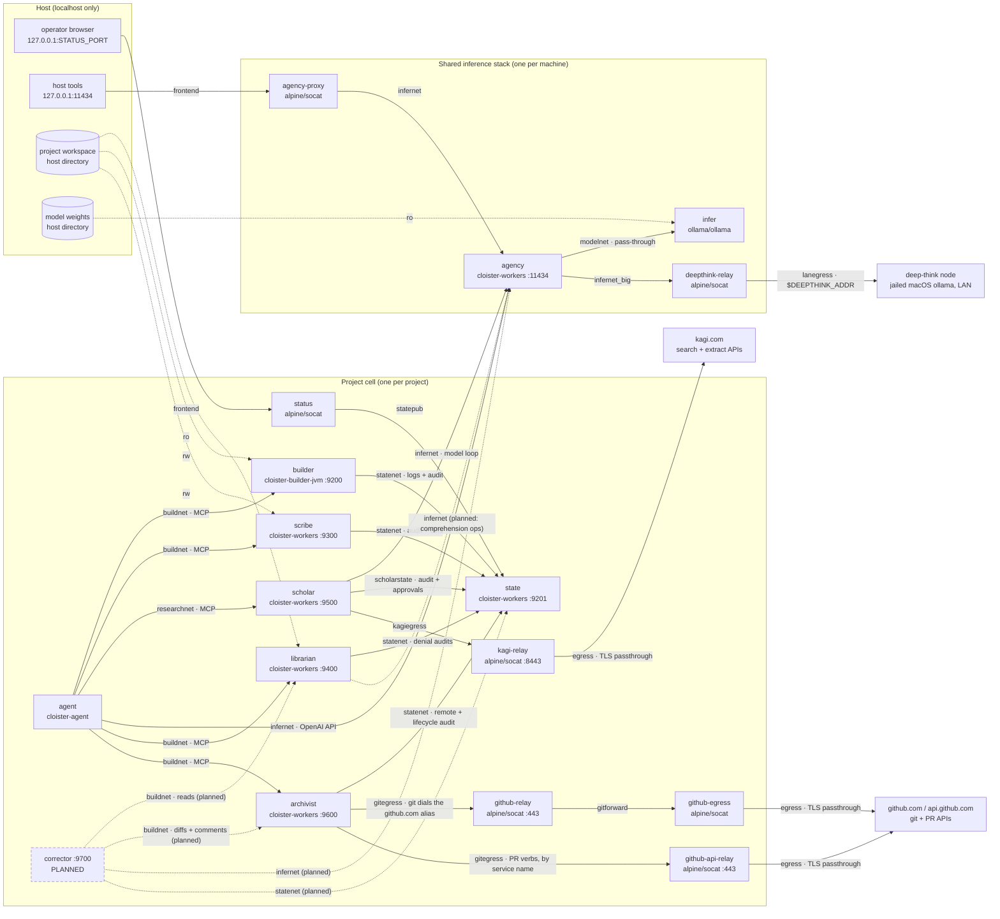

# Cloister — Runtime Architecture

What actually deploys: every container, the networks that connect them, the
worker role and image in each, the filesystem mounts, and the two localhost
ports that are the system's entire host-visible surface.  This is the *what*;
[DESIGN.md](DESIGN.md) is the *why*.

Two compose stacks make up a running system:

- **Shared inference stack** (`docker/inference.yaml`) — the GPU model
  server, the **agency** (the sole inference door fronting it), and the
  localhost bridge.  Deploy once per machine, leave up.
- **Project cell** (`docker/ai-workers.yaml`) — the agent and its workers.
  Deploy one per project; each joins the shared `infernet` by name and
  reaches models only through the agency.

## Topology

```mermaid
flowchart LR
  subgraph host["Host (localhost only)"]
    op["operator browser<br/>127.0.0.1:STATUS_PORT"]
    dbg["host tools<br/>127.0.0.1:11434"]
    ws[("project workspace<br/>host directory")]
    models[("model weights<br/>host directory")]
  end

  subgraph cell["Project cell (one per project)"]
    agent["agent<br/>cloister-agent"]
    builder["builder<br/>cloister-builder-jvm :9200"]
    scribe["scribe<br/>cloister-workers :9300"]
    scholar["scholar<br/>cloister-workers :9500"]
    state["state<br/>cloister-workers :9201"]
    status["status<br/>alpine/socat"]
    krelay["kagi-relay<br/>alpine/socat :8443"]
    librarian["librarian<br/>cloister-workers :9400"]
    archivist["archivist<br/>cloister-workers :9600"]
    ghrelay["github-relay<br/>alpine/socat :443"]
    ghegress["github-egress<br/>alpine/socat"]
    ghapi["github-api-relay<br/>alpine/socat :443"]
    corrector["corrector :9700<br/>PLANNED"]
  end

  subgraph infra["Shared inference stack (one per machine)"]
    agency["agency<br/>cloister-workers :11434"]
    infer["infer<br/>ollama/ollama"]
    iproxy["agency-proxy<br/>alpine/socat"]
    dtrelay["deepthink-relay<br/>alpine/socat"]
  end

  kagi["kagi.com<br/>search + extract APIs"]
  gh["github.com / api.github.com<br/>git + PR APIs"]
  mac["deep-think node<br/>jailed macOS ollama, LAN"]

  agent -- "buildnet · MCP" --> builder
  agent -- "buildnet · MCP" --> scribe
  agent -- "researchnet · MCP" --> scholar
  agent -- "infernet · OpenAI API" --> agency
  scholar -- "infernet · model loop" --> agency
  agency -- "modelnet · pass-through" --> infer
  builder -- "statenet · logs + audit" --> state
  scribe -- "statenet · audit + diffs" --> state
  scholar -- "scholarstate · audit + approvals" --> state
  scholar -- "kagiegress" --> krelay
  krelay -- "egress · TLS passthrough" --> kagi
  op -- "frontend" --> status
  status -- "statepub" --> state
  dbg -- "frontend" --> iproxy
  iproxy -- "infernet" --> agency

  ws -. "ro" .-> librarian
  ws -. "rw" .-> builder
  ws -. "rw" .-> scribe
  agent -- "buildnet · MCP" --> librarian
  librarian -- "statenet · denial audits" --> state
  models -. "ro" .-> infer

  agent -- "buildnet · MCP" --> archivist
  archivist -- "statenet · remote + lifecycle audit" --> state
  archivist -- "gitegress · git dials the github.com alias" --> ghrelay
  archivist -- "gitegress · PR verbs, by service name" --> ghapi
  ghrelay -- "gitforward" --> ghegress
  ghegress -- "egress · TLS passthrough" --> gh
  ghapi -- "egress · TLS passthrough" --> gh

  librarian -. "infernet (planned: comprehension ops)" .-> agency
  corrector -. "buildnet · reads (planned)" .-> librarian
  corrector -. "buildnet · diffs + comments (planned)" .-> archivist
  corrector -. "infernet (planned)" .-> agency
  corrector -. "statenet (planned)" .-> state
  agency -- "infernet_big" --> dtrelay
  dtrelay -- "lanegress · $DEEPTHINK_ADDR" --> mac

  classDef planned stroke-dasharray: 6 4;
  class corrector planned
```

Solid arrows are network edges (labeled with the compose network that
carries them); dotted arrows are filesystem mounts or planned components.
The agent holds **no workspace mount at all**: reads go through the
librarian (shield-filtered per [librarian.md](librarian.md)), writes
through the scribe, and the agent's working directory is a tmpfs stub.

## The cell, container by container

| Container | Worker role | Image | Listens | Mounts | Networks |
|---|---|---|---|---|---|
| `agent` | the coding agent: interactive qwen-code CLI (this IS the qwen image) | `cloister-agent:<qwen>-<ver>` | — (nothing inbound) | NO workspace (tmpfs cwd stub); `qwen_home` vol rw | infernet, buildnet, researchnet |
| `builder` | `builder` role — executes manifest actions (build/test), streams logs | `cloister-builder-jvm:<jdk>-<ver>` (the cell's ONE toolchain image, [toolchains.md](toolchains.md)) | `:9200` MCP | workspace **rw**; `gradle` vol rw | buildnet, statenet |
| `scribe` | `scribe` role — the sole audited writer of workspace source | `cloister-workers:<ver>` | `:9300` MCP | workspace **rw**; `scribe_state` vol rw | buildnet, statenet |
| `librarian` | `librarian` role — the read side: shield-filtered mechanical read tools from an in-memory model; denials audited | `cloister-workers:<ver>` | `:9400` MCP | workspace **ro** | buildnet, statenet |
| `scholar` | `scholar` role — quarantined web research, one `research` tool | `cloister-workers:<ver>` | `:9500` MCP | policy yaml **ro**; `scholar_burn` vol rw | researchnet, infernet, scholarstate, kagiegress |
| `archivist` | `archivist` role — the cell's sole VCS authority: grange lifecycle (`provision`/`dispose`), the local checkpoint verbs, audited-ungated PR authorship as the bot ([archivist.md](archivist.md)) | `cloister-workers:<ver>` | `:9600` MCP | `grange` vol rw (the grange ROOT — NEVER the host workspace); endpoint table + bot token **ro** | buildnet, statenet, gitegress |
| `state` | `state-service` role — sole owner of durable logs/audit/status | `cloister-workers:<ver>` | `:9201` token-gated API + pages | `state` vol rw | statenet, scholarstate, statepub |
| `status` | blind relay publishing the status pages to the host | `alpine/socat` | `127.0.0.1:STATUS_PORT` | — | statepub, frontend |
| `kagi-relay` | blind egress pipe hard-wired to `kagi.com:443` | `alpine/socat` | `:8443` (cell-internal) | — | kagiegress, egress |
| `github-relay` | blind git front: carries the `github.com` network alias git dials (TLS verifies the real cert end-to-end), pipes to the egress hop | `alpine/socat` | `:443` (cell-internal) | — | gitegress, gitforward |
| `github-egress` | blind egress hop resolving the real `github.com` — split from the front so no container both holds the alias and resolves it | `alpine/socat` | `:443` (gitforward-internal) | — | gitforward, egress |
| `github-api-relay` | blind pipe to `api.github.com` for the PR verbs; dialed by service name with SNI verifying the real host, so one relay suffices | `alpine/socat` | `:443` (cell-internal) | — | gitegress, egress |

All the cell's Go workers — and the infra stack's agency below — are the
same multi-call binary (`cloister-worker`): each image bakes role links,
each compose service execs its own link, and the program name selects the
role and its flag set (a flag from the wrong role is a startup error).
Under the generic name — including the images' `agent-builder` compat
link — a leading `-worker-mode <role>` selects instead.

Images split along the capability line ([toolchains.md](toolchains.md)):
`cloister-workers` is slim and toolchain-free (scratch + the static
binary + CA roots), and only the **builder** runs a per-ecosystem
toolchain image (`cloister-builder-jvm` today: JDK 25 + Gradle-wrapper
support) — the compilers live where the manifest actions execute and
nowhere else.

## The shared inference stack

| Container | Role | Image | Listens | Mounts | Networks |
|---|---|---|---|---|---|
| `agency` | `agency` role — the sole inference door: streaming OpenAI-compatible pass-through, `/v1` only ([agency.md](agency.md) phase 1) | `cloister-workers:<ver>` | `:11434` (infernet) | — | infernet, modelnet, infernet_big |
| `infer` | GPU model server (OpenAI-compatible API), reachable only via the agency | `ollama/ollama` | `:11434` (modelnet only) | model weights **ro** (host dir) | modelnet |
| `agency-proxy` | blind relay for host smoke tests, fronting the agency | `alpine/socat` | `127.0.0.1:11434` | — | infernet, frontend |
| `deepthink-relay` | blind relay to the LAN deep-think node ([deepthink.md](deepthink.md)), target from the `DEEPTHINK_ADDR` stack var (dead loopback when unset — the node just probes absent) | `alpine/socat` | `:11434` (infernet_big only) | — | infernet_big, lanegress |

## Networks

| Network | Carries | Members |
|---|---|---|
| `infernet` | consumer → agency model API traffic (internal: no internet; shared across stacks by name) | agency, agency-proxy, agent, scholar |
| `modelnet` | agency → infer (internal; the model server's ONLY edge) | agency, infer |
| `buildnet` | agent → builder/scribe/librarian/archivist MCP | agent, builder, scribe, librarian, archivist |
| `researchnet` | agent → scholar MCP | agent, scholar |
| `statenet` | builder/scribe/librarian/archivist → state (token-gated) | builder, scribe, librarian, archivist, state |
| `scholarstate` | scholar → state, kept off `statenet` so the scholar never shares a wire with builder/scribe | scholar, state |
| `statepub` | state → status relay | state, status |
| `kagiegress` | scholar → kagi-relay (internal; no internet) | scholar, kagi-relay |
| `gitegress` | archivist → the git relays (internal; no internet).  Carries the `github.com` alias on the front relay | archivist, github-relay, github-api-relay |
| `gitforward` | github-relay → github-egress — the middle of the git two-hop (internal) | github-relay, github-egress |
| `infernet_big` | agency → deepthink-relay (internal; the deep-think path's only agency-side edge) | agency, deepthink-relay |
| `lanegress` | deepthink-relay → the LAN deep-think node.  ONLY the relay holds it | deepthink-relay |
| `egress` | the internet.  ONLY the egress-holding relays touch it | kagi-relay, github-egress, github-api-relay |
| `frontend` | host publishing | status, agency-proxy |

Every network except `egress`, `lanegress`, and `frontend` is
`internal: true` — no route out.  Notable absences are the architecture: the agent has no route
to `state` (it cannot touch the record of its own actions), `infer` shares
a network with nothing but the agency, and the scholar has no route to
builder, scribe, or the workspace.

## Host surface

Exactly two localhost-only ports; nothing binds a routable interface:

- `127.0.0.1:${STATUS_PORT}` — the cell's status pages and approvals UI,
  via the blind `status` relay.  The only externally visible piece of a
  cell.
- `127.0.0.1:11434` — the inference stack's OpenAI-compatible door (the
  agency), for host smoke tests (`GET /v1/models`), via the blind
  `agency-proxy`.  Raw ollama has no host port; model staging uses the
  host-side ollama store directly.

## External dependencies

| Dependency | Used for | Path out |
|---|---|---|
| `kagi.com` | web **search** and the **extract/summarize** API (fetches and cleans pages to markdown server-side) | scholar → kagi-relay → `kagi.com:443`, TLS end-to-end (the relay pipes ciphertext) |
| `api.search.brave.com` (optional) | alternate search engine when the scholar policy selects it; extract stays Kagi-only | would need its own `brave-relay`; never yet exercised against the real API |
| deep-think node | heavyweight chain-of-thought lanes: `deep-think`, `review`, `research`, and `think-fast` lead here and degrade to local `infer` when the machine is away | agency → deepthink-relay → `$DEEPTHINK_ADDR` on the LAN (the node's own blind relay, [deepthink.md](deepthink.md)); no address in-repo |

Image pulls from GHCR happen at deploy time only; nothing in a running
cell fetches images or code.

## Named volumes

| Volume | Mounted by | Holds |
|---|---|---|
| `qwen_home` | agent | qwen-code settings/history (`/home/node/.qwen`); survives image swaps |
| `gradle` | builder | dependency + build caches (`/gradle-home`), warmed via the airlock |
| `state` | state | the durable record: logs, audit, status, approvals |
| `scribe_state` | scribe | staged approval-gated changes; survives restarts so a pending approval is never lost |
| `scholar_burn` | scholar | restart-surviving spend ledger (bare timestamps), so a crash loop cannot reset daily caps |
| `grange` | archivist | the grange ROOT: `tree/` (the exported checkout) and `staging/` (the pre-promote clone).  `provision` fills it, `dispose` empties it; NEVER the operator's host tree ([grange.md](grange.md)) |

## Planned components

Dashed in the diagram; designed, not yet built (see
[librarian.md](librarian.md)):

- **librarian comprehension ops** (phase 5 of [librarian.md](librarian.md))
  — the inference-backed tools (summarize, ask-about) atop the now-live
  mechanical read path; brings the librarian its `infernet` edge and the
  engine-routed client the agency design absorbs.
- **corrector** (`:9700`, see [corrector.md](corrector.md)) — the
  reviewer: no mounts, no credential; composes librarian reads, archivist
  diffs/comments, and engine-routed inference into a ten-lens, grounded,
  advice-never-gate review of any PR or the agent's pending work.
- **agency, phases 2+** (see [agency.md](agency.md)) — phase 1 (the
  pass-through door, live above) proved the topology: `infer` sits behind
  the agency on `modelnet` and the localhost `11434` relay fronts the
  door.  Still to come: named engine classes over fail-closed config,
  residency-aware two-class queueing, caller deadlines, presence-aware
  fallback chains to the deep-think node, frontier slots (designed-for,
  unwired), and a read-only status volume the cells' state services
  render.

## The common hardening profile

Every container in both stacks runs the same jail unless noted: read-only
root filesystem with tmpfs scratch, `cap_drop: [ALL]`,
`no-new-privileges`, pids and memory limits, non-root (uid 1000; the socat
relays run as `nobody`), `restart: unless-stopped`.  Per-container
particulars: the builder gets a 2 GiB `/tmp` and a private log spool; the
agent gets 512 pids for the CLI's node runtime; `infer` gets the GPU
device reservation.

## Invariants and what enforces them

| Invariant | Enforced by |
|---|---|
| The scholar holds no `egress` network; its only route out is the kagi-relay, pinned to `kagi.com` | `compose-lint` (CI, every PR) · the scholar's fail-closed boot self-check · `scripts/probe-scholar-egress.ps1` against a live cell |
| All inference rides through the agency: `infer` sits on `modelnet` alone, consumers dial the door, the localhost relay fronts it | `compose-lint` on both compose files (CI, every PR) |
| Only the builder carries a toolchain; every other worker runs the slim toolchain-free image | `compose-lint` image-variable pinning (builder ↔ `TOOLCHAIN_IMAGE`, others ↔ `WORKERS_IMAGE`) |
| The agent cannot write source; every edit routes through the scribe's confined, audited ops | the `:ro` mount flag · the scribe's path confinement, gates, and approval holds |
| The archivist is jailed: exactly buildnet + statenet + gitegress, the grange volume (never the host tree), forges reached only through pinned relays with literal socat destinations, the `github.com` alias and its resolution split across the two-hop pair, and only the egress-holding relays on `egress` | `compose-lint` (CI, every PR) · the endpoint table as remote allowlist · the archivist's client-side refusals (audited) |
| The audit trail is one-way glass: subsystems append, never read; timestamps come from the state service's clock | token-gated append-only state API · no state mounts anywhere else · network absences above |
| Web content and workspace content never share a mediator | topology: the scholar has no workspace mount and no route to builder/scribe |
| A jailed worker cannot resolve external names — DNS is not an exfiltration channel (CVE-2024-29018) | `dns: 127.0.0.1` (dead upstream) on every all-internal service in both compose files · `compose-lint`'s DNS-pin rule (CI, every PR) · the scholar's fail-closed boot DNS probe |
| Builds run offline; dependency refresh is a deliberate human act | no builder egress · the dependency airlock refuses to open over uncommitted build logic |
| No secrets, keys, or LAN addresses in the repo | presubmit hook + the same scan server-side in CI |
